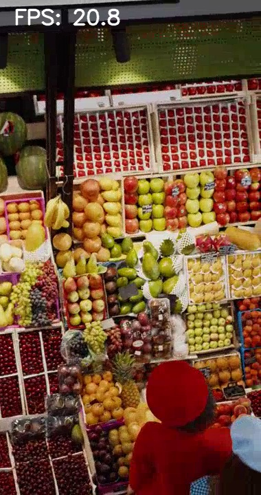

# storeguard
Real-time unmanned store CCTV anomaly detection (ONNX + TensorRT).무인매장 CCTV 영상을 실시간 스트림처럼 처리하고 이상행동 감지 프로젝트

무인가게(또는 CCTV 환경)에서 발생할 수 있는 이상행동을 **실시간 영상 파이프라인**으로 탐지/표시하는 미니 데모입니다.  
5일 안에 “돌아가는 증거”를 남기는 것이 목표이며, 이후 상용 최적화 루트(ONNX Runtime/TensorRT)까지 확장 가능한 구조로 설계합니다.

## Goals
- 영상 입력(loop) → 추론 → 오버레이 출력까지 **엔드투엔드 파이프라인 증명**
- baseline vs 최적화(ONNX Runtime → TensorRT)로 **FPS/latency 비교 지표** 남기기
- 결과물: 실행 방법, 스크린샷, 성능 로그, 간단한 아키텍처/설명(README)

## Scope (5 days)
- D1: Video loop MVP + FPS overlay + screenshot
- D2: YOLO(person) bbox overlay (baseline detector)
- D3: ONNX export + ONNX Runtime inference
- D4: (가능하면) TensorRT 변환/추론 + 성능 측정
- D5: README 정리(지표/스크린샷) + 포트폴리오 패키징

## Demo (D1-2 Video Loop MVP)
```bash
python scripts/demo_video.py
```
- q: quit
- s: save screenshot to assets/images/storeguard_d1_video_loop.jpg


