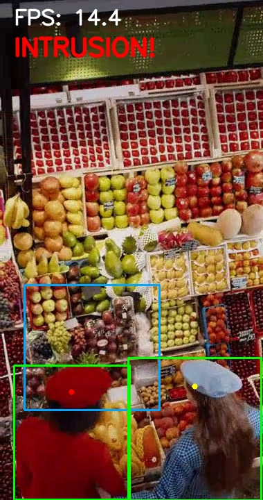
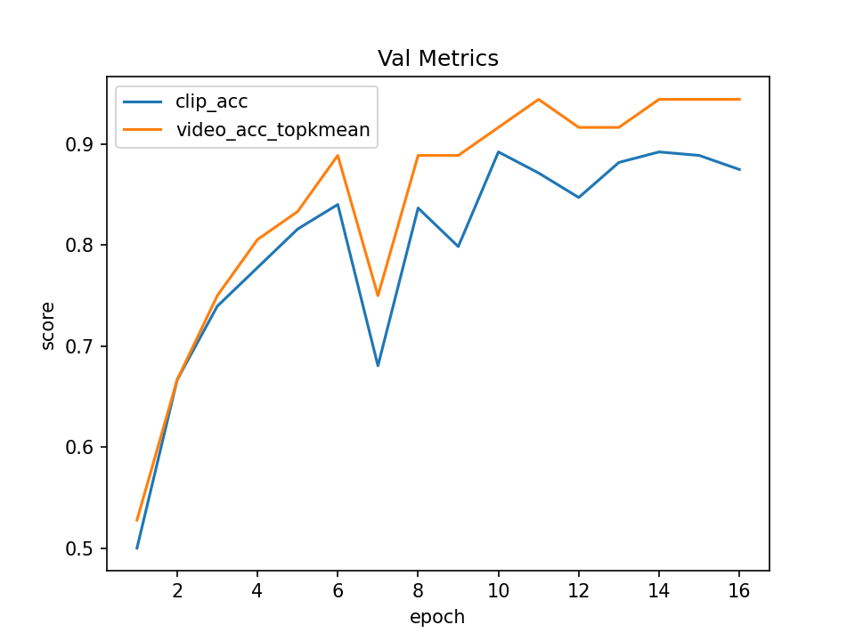
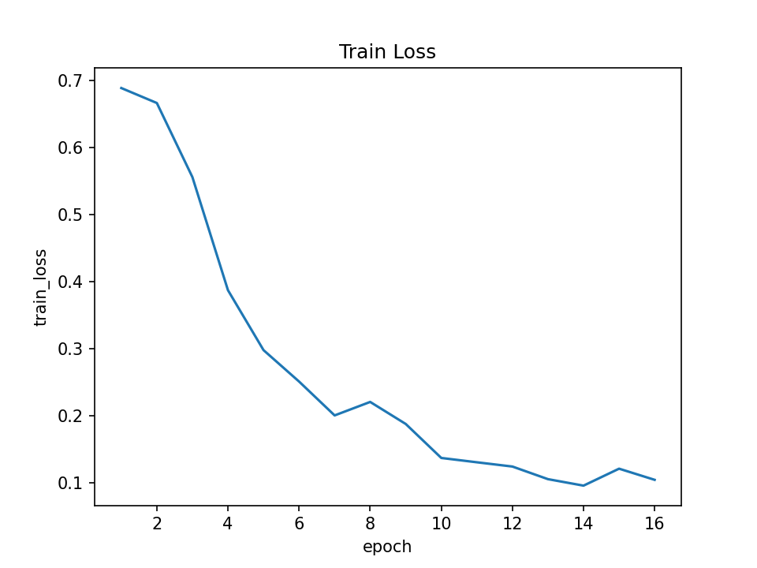
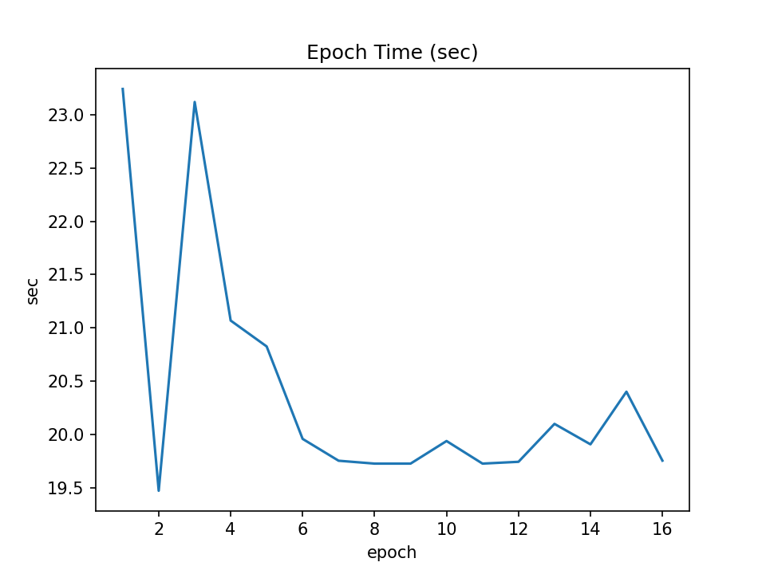

# storeguard
Real-time unmanned store CCTV anomaly detection (ONNX + TensorRT).무인매장 CCTV 영상을 실시간 스트림처럼 처리하고 이상행동 감지 프로젝트

무인가게(또는 CCTV 환경)에서 발생할 수 있는 이상행동을 **실시간 영상 파이프라인**으로 탐지/표시하는 미니 데모입니다.  
5일 안에 “돌아가는 증거”를 남기는 것이 목표이며, 이후 상용 최적화 루트(ONNX Runtime/TensorRT)까지 확장 가능한 구조로 설계합니다.

## Goals
- 영상 입력(loop) → 추론 → 오버레이 출력까지 **엔드투엔드 파이프라인 증명**
- baseline vs 최적화(ONNX Runtime → TensorRT)로 **FPS/latency 비교 지표** 남기기
- 결과물: 실행 방법, 스크린샷, 성능 로그, 간단한 아키텍처/설명(README)

## Scope (5 days)
- D1: Video loop + FPS overlay + screenshot
- D2: ROI intrusion event (YOLO person + head-point rule)
- D3: TensorRT FP16 engine build + evidence log + benchmark
- D4: ORT(CUDA) vs TRT(FP16) 비교 + E2E FPS/p95 측정
- D5: (Optional) Triton serving + 포트폴리오 패키징

## Demo (D1-2 Video Loop MVP)
```bash
python scripts/demo_video.py
```
- q: quit
- s: save screenshot to assets/images/storeguard_d1_video_loop.jpg


## Demo (D2 Intrusion Event)
```bash
python scripts/demo_video.py
```
- q: quit
- s: save screenshot (e.g., assets/images/storeguard_d2_intrusion.jpg)

Intrusion rule: if "head-point" (bbox center at 20% height) enters ROI rectangle, trigger event with cooldown.


## ONNX Smoke Test (WSL GPU)
```bash
./scripts/run_onnx.sh scripts/onnx_smoke.py
./scripts/run_onnx.sh -c "import onnxruntime as ort; print(ort.get_available_providers())"
```
## NGC (nvcr.io) Login (for TensorRT container)
- Username: `$oauthtoken`
- Password: NGC API Key 

## TensorRT FP16 (D3)

We export YOLOv8n to ONNX and build a TensorRT FP16 engine using `trtexec` (via NGC Docker image).
This leaves reproducible evidence logs and produces an `.engine` for future Triton serving.
- Input ONNX: `outputs/models/yolov8n_320.onnx`
- Output Engine: `outputs/engine/yolov8n_320_fp16.engine`
- Evidence log: `outputs/logs/d3_trt_build_fp16.log`
- Benchmark (trtexec summary): Throughput ~742 qps, mean latency ~1.27 ms (RTX 4080 SUPER, FP16)

### Performance (single-batch, 320x320, RTX 4080 SUPER)
| Runtime | Precision | Mean Latency (ms) | Throughput (qps) | Evidence |
|---|---:|---:|---:|---|
| TensorRT | FP16 | 1.27 | 741.8 | outputs/logs/d3_trt_build_fp16.log |

### 1) Run TensorRT container (WSL/GPU)
We use the NGC TensorRT container so local TensorRT installation is not required.

### 2) Build FP16 engine (ONNX → .engine)
```bash
mkdir -p outputs/engine outputs/logs

trtexec_trt \
  --onnx=outputs/models/yolov8n_320.onnx \
  --saveEngine=outputs/engine/yolov8n_320_fp16.engine \
  --fp16 \
  2>&1 | tee outputs/logs/d3_trt_build_fp16.log
```
### Environment stamp (D3)
- Host: RTX 4080 SUPER (WSL2), see `nvidia-smi` in `outputs/logs/d3_trt_stamp.log`
- Docker: see `outputs/logs/d3_trt_stamp.log`
- TensorRT container: `nvcr.io/nvidia/tensorrt:25.12-py3` (TensorRT 10.14.1)

### Reproducible TensorRT commands (no shell functions)
- `scripts/trt.sh`: runs commands inside the TensorRT NGC container
- `scripts/trtexec_trt.sh`: convenience wrapper for `trtexec`

Example:
```bash
./scripts/trtexec_trt.sh --help | head
```

## 15 완료 판정
- 새 셸(함수 없는 상태)에서 아래가 되면 끝
```bash
# 1) trtexec 동작 확인
./scripts/trtexec_trt.sh -h | head

# 2) TensorRT 버전 스탬프
./scripts/trt.sh python -c "import tensorrt as trt; print(trt.__version__)"

```

## Triton Quickstart (D4 / P0: ONNX Serving)

Serve the exported ONNX model with Triton and run a 1-shot HTTP inference.

### 0) Prereq
- Docker + NVIDIA Container Toolkit (GPU)
- `docker login nvcr.io` (NGC)

### 1) Start Triton server (ONNX model repo)
```bash
mkdir -p outputs/logs

docker run --rm --gpus all --net=host \
  -v "$PWD/models":/models \
  nvcr.io/nvidia/tritonserver:25.12-py3 \
  tritonserver --model-repository=/models \
  2>&1 | tee outputs/logs/d4_triton_server_onnx.log
```
### 2) Check model is ready
```bash
curl -s localhost:8000/v2/health/ready && echo
curl -s localhost:8000/v2/models/yolov8n_320_onnx && echo
```
### 3) 1-shot inference (client)
```bash
pip install -q "tritonclient[http]" numpy
python scripts/triton_client_once.py 2>&1 | tee outputs/logs/d4_triton_client_once.log
```
## Triton Serving (D3) — TensorRT Engine (P1 Stamp)

We serve the TensorRT FP16 engine using NVIDIA Triton Inference Server and leave reproducible server/client logs.

- Model: `yolov8n_320_trt` (`platform: tensorrt_plan`)
- Input: `images` = `[1,3,320,320]` FP32
- Output: `output0` = `[1,84,2100]` FP32
- Evidence logs:
  - Server: `outputs/logs/d3_triton_server_trt.log`
  - Client: `outputs/logs/d3_triton_client_once_trt.log`

### 1) Start Triton server (GPU)
```bash
mkdir -p outputs/logs

docker run --rm --gpus all \
  -p 8000:8000 -p 8001:8001 -p 8002:8002 \
  -v "$PWD/models":/models \
  --name triton_storeguard \
  nvcr.io/nvidia/tritonserver:25.12-py3 \
  tritonserver --model-repository=/models \
  2>&1 | tee outputs/logs/d3_triton_server_trt.log
```
### 2) Health + model metadata
```bash
curl -sS -o /dev/null -w "ready http=%{http_code}\n" http://127.0.0.1:8000/v2/health/ready
curl -sS http://127.0.0.1:8000/v2/models/yolov8n_320_trt | head
```
### 3) 1-shot inference (client)
```bash
python scripts/triton_client_once.py 2>&1 | tee outputs/logs/d3_triton_client_once_trt.log
```

## Modeling Track (v1) — Clip-sampled Video Classifier (MobileNetV3 + TAP)

This branch adds a lightweight **video-level classifier** to complement the real-time detector pipeline.  
Goal: **fast, deployable, and time-aware** modeling with reproducible evidence (logs/plots).

---

### Data
- Source: Kaggle shoplifting videos (≈10s each).
- Labels: `normal` vs `shoplifting`
- Raw videos are **NOT** committed (scripts/CSV/metrics only).

---

### Method
- **Backbone**: MobileNetV3 (ImageNet pretrained) as per-frame feature extractor
- **Temporal module**: Temporal Attention Pooling (TAP) over `T=16` frames
- **Head**: 1-layer binary classifier
- **Video-level scoring**: `top-k mean` aggregation over multiple sampled clips per video (default `k=3`)
- **Training**: transfer learning (freeze backbone for first N epochs, then unfreeze), AMP enabled  
  - Note: Freezing reduces **backprop** cost, but **decode/preprocess + forward** still dominate, so epoch time may remain similar (cache helps most).

---

### Pipeline
1) `videos.csv` → generate train/val splits  
2) sample clip windows → `data/clips/*_clips.csv`  
3) (optional but recommended) cache decoded frames into `.npz` to remove decode bottleneck  
4) train with early stopping + export metrics / best checkpoint  
5) plot curves from `metrics.json`

---

### Reproduce
```bash
# 1) generate clip sampling CSVs
python scripts/modeling/make_clips.py

# 2) optional cache (faster epochs)
python scripts/modeling/cache_video_npz.py --cache_fps 8 --size 256

# 3) train (example: seed sweep)
BASE=outputs/modeling/run_006_seed_sweep
for S in 42 43 44; do
  python scripts/modeling/train_v1.py \
    --use_cache --epochs 30 --early_patience 5 \
    --batch 8 --amp --num_workers 8 \
    --dropout 0.3 --wd 3e-4 --video_topk 3 \
    --seed $S --out_dir ${BASE}_seed${S}
done

# 4) plot metrics (example: headline run)
python scripts/modeling/plot_metrics.py \
  --metrics outputs/modeling/run_006_seed_sweep_seed43/metrics.json \
  --out outputs/modeling/run_006_seed_sweep_seed43/history.png

```
## Results (video-level, top-k mean)

### Results (video-level, top-k mean)

| Run | Seed | Best `video_acc_topkmean` |
|---|---:|---:|
| `run_006_seed_sweep_seed42` | 42 | 0.9167 |
| `run_006_seed_sweep_seed43` | 43 | 0.9444 |
| `run_006_seed_sweep_seed44` | 44 | 0.9444 |

**Recommendation:** Use **one best run** as the headline (plot + `metrics.json`), and keep the seed sweep as stability evidence.

---

### Evidence
- Loader/decoder checks: `outputs/logs/loader_smoke_*.txt`
- Clip decode sample: `outputs/videos/smoke_clip_*.mp4`
- Training metrics: `outputs/modeling/run_*/metrics.json`
- Curves: `outputs/modeling/run_*/plots/history_*.png`

---

### Notes / Limitations
- Dataset is small and may not match Korean store CCTV domain.


### Headline run plots
Run: `run_006_seed_sweep_seed43`

<p align="center">
  
</p>

<p align="center">
  
</p>

<p align="center">
  
</p>

### Next
- Replace dataset (AIHub/partner data)
- Add temporal head (tiny transformer)
- Integrate into serving pipeline